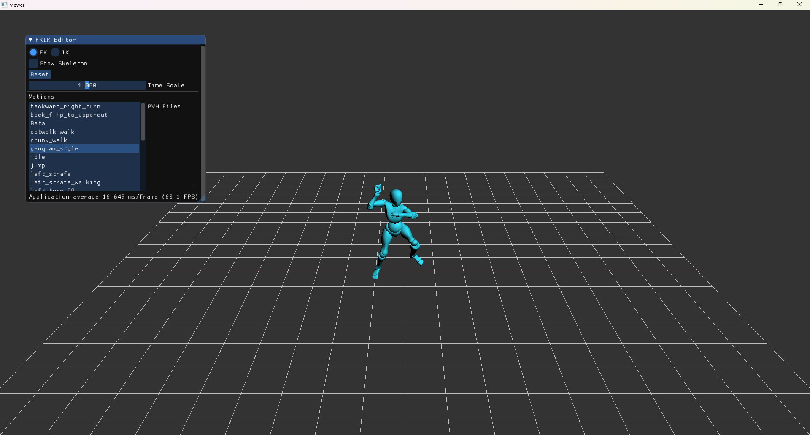
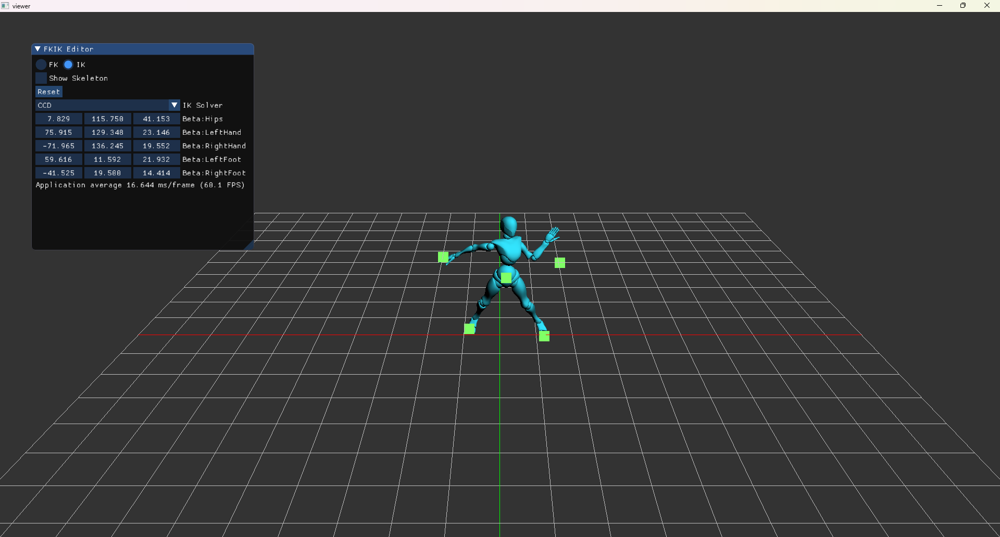
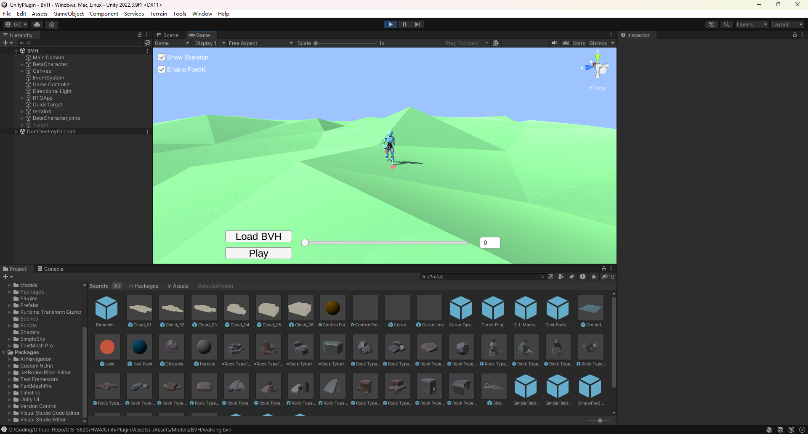

Below is the demonstration of the Forward Kinematics (FK) system in a dancing motion:

For the Inverse Kinematics (IK) part, I implemented Limb-based IK, CCD, and Pseudo Inverse:

I also played with unity plugin:
