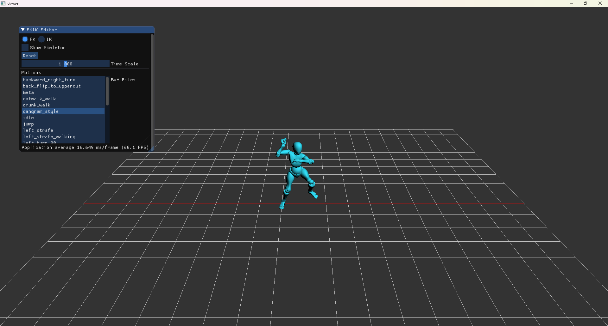
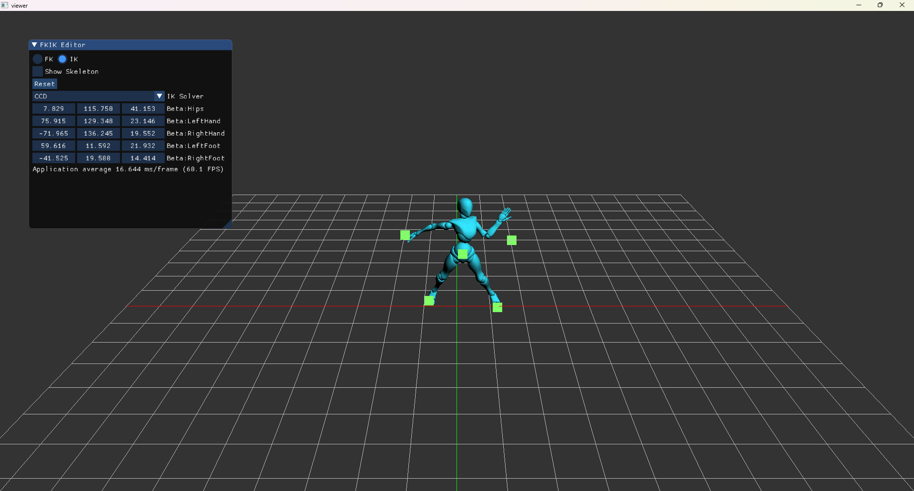
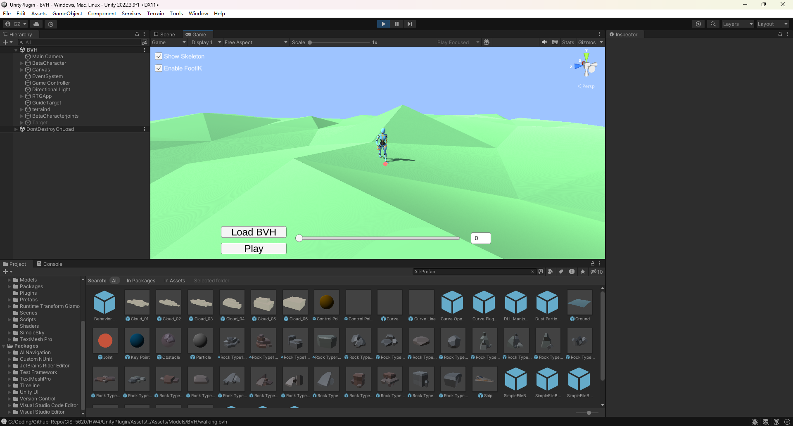
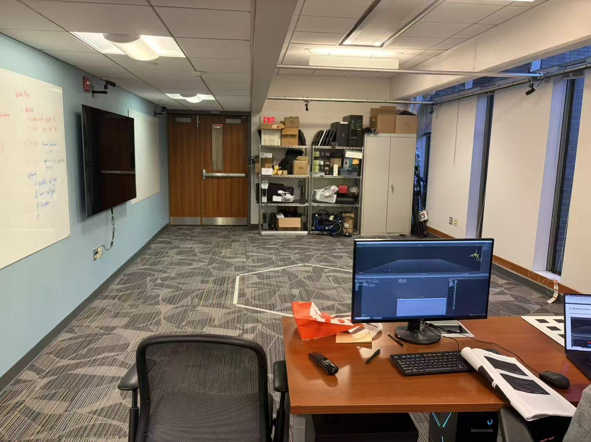

A C++ kinematics toolkit supporting forward and inverse kinematics with quaternion-based orientation interpolation. Three IK solvers are implemented: Limb-based, CCD (Cyclic Coordinate Descent), and Pseudo-Inverse Jacobian.

Demonstration of the Forward Kinematics (FK) system in a dancing motion:

Inverse Kinematics (IK) using Limb-based, CCD, and Pseudo-Inverse Jacobian solvers:

Unity plugin integration:

UPenn Motion Capture System:
